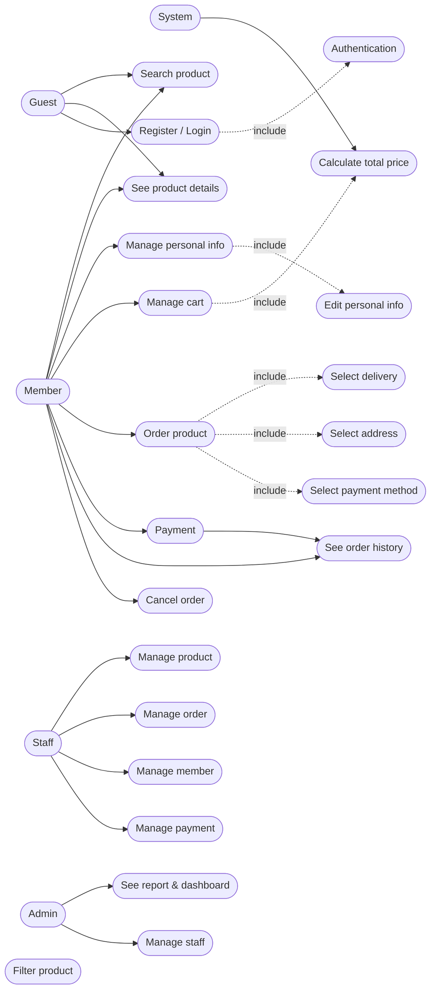
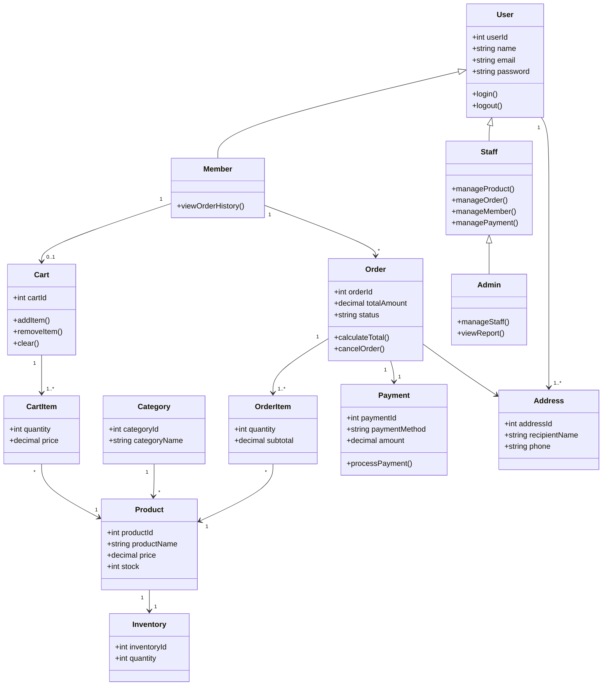
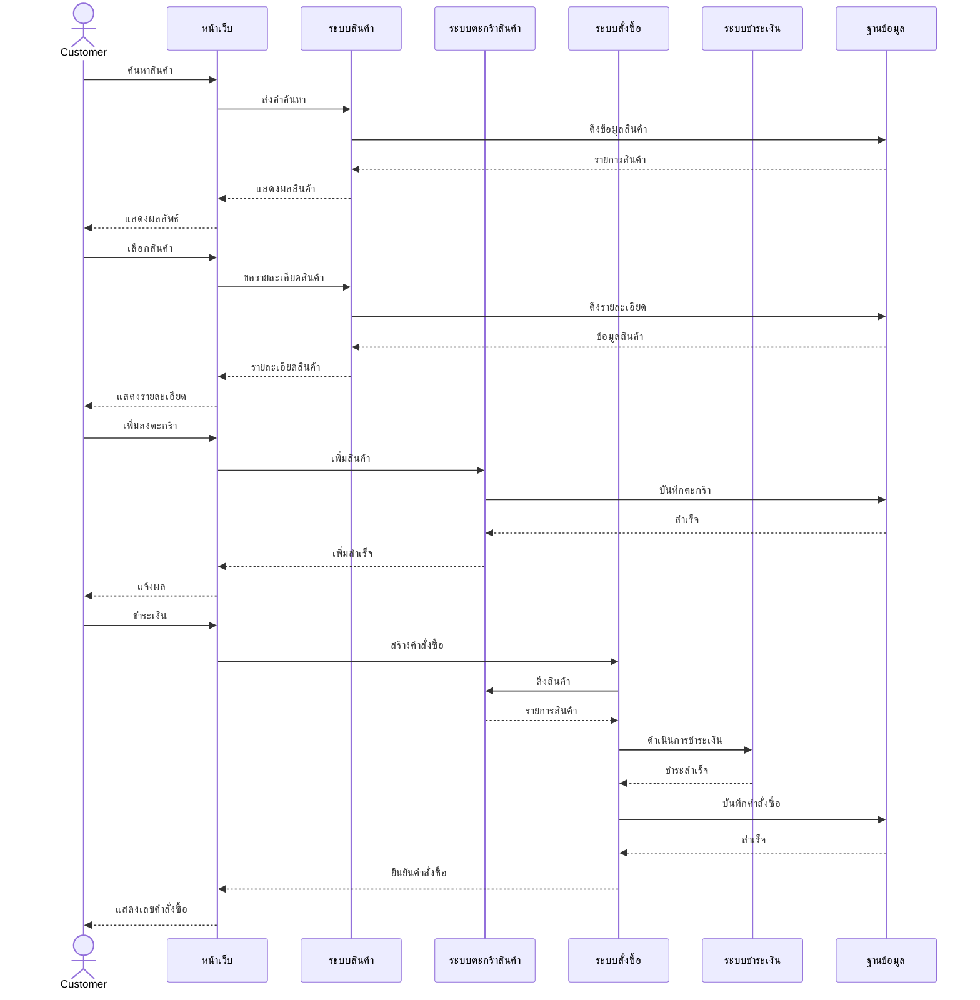

# 🌸 Homeflowers.shop - บ้านดอกไม้

ระบบร้านค้าออนไลน์สำหรับจำหน่ายดอกไม้แห้งและดอกไม้ประดิษฐ์

---

## 👥 ข้อมูลกลุ่ม

**ชื่อกลุ่ม:** Flower Ranger  
**จำนวนสมาชิก:** 5 คน

| รหัส | ชื่อ - นามสกุล | หน้าที่รับผิดชอบ |
|------|---|---|
| 67145066 | สุดารัตน์ แครงกลาง |  Project Manager |
| 67156802 | ณัฐวุฒิ สังข์ประเสริฐ |  Backend Developer |
| 67167533 | ภีมวิชญ์ พุ่มน้อย |  Frontend Developer |
| 67147511 | ธุรานนท์ ห่อทอง |  System Analysis |
| 67155882 | ปธานิน วัฒนชัยพงษ์ |  Tester / General |

---

## 💡 หลักการและเหตุผล

- ดอกไม้แห้งและดอกไม้ประดิษฐ์ค่อนข้างเป็นที่นิยมมากในขณะนี้ นิยมให้กันในโอกาสพิเศษต่างๆ เพราะสามารถเก็บได้นาน ไม่เหี่ยว จัดส่งง่าย ดูแลง่ายด้วย
- จากความนิยม ผู้จัดทำจึงมีแนวคิดในการพัฒนาระบบพาณิชย์อิเล็กทรอนิกส์ (e-Commerce) สำหรับร้านจำหน่ายดอกไม้แห้ง/ประดิษฐ์ เพื่อเป็นช่องทางในการนำเสนอสินค้า เพิ่มความสะดวกในการเลือกซื้อสินค้า การสั่งซื้อ การชำระเงิน และการติดตามสถานะคำสั่งซื้อผ่านระบบออนไลน์ อีกทั้งยังช่วยให้ผู้ประกอบการสามารถบริหารจัดการข้อมูลสินค้า คำสั่งซื้อ และข้อมูลลูกค้าได้อย่างมีประสิทธิภาพ ส่งผลให้การดำเนินธุรกิจมีความสะดวก รวดเร็ว และสามารถขยายฐานลูกค้าได้มากยิ่งขึ้น

---

## 🎯 วัตถุประสงค์

1. เพื่อวิเคราะห์และออกแบบระบบซื้อขายดอกไม้แห้ง ดอกไม้ประดิษฐ์
2. เพื่อพัฒนาระบบซื้อขายดอกไม้แห้ง ดอกไม้ประดิษฐ์
3. เพื่อทดสอบและประเมินผลจากการใช้งานระบบ

---

## 📐 ขอบเขตของระบบ

ระบบประกอบด้วยกระบวนการทำงาน 3 ส่วน:

### 1️⃣ ลูกค้า (Customer)
- ✅ สมัครสมาชิก เข้าสู่ระบบ และจัดการแก้ไขข้อมูลส่วนตัว
- ✅ ค้นหาและแสดงรายการสินค้าตามความต้องการ
- ✅ สร้างตะกร้าสินค้า และจัดการข้อมูลในตะกร้า
- ✅ สั่งซื้อสินค้า เลือกรูปแบบการชำระเงิน และการจัดส่ง
- ✅ ตรวจสอบและติดตามสถานะคำสั่งซื้อ

### 2️⃣ พนักงาน (Staff)
- 📦 จัดการข้อมูลสินค้า (CRUD)
- 💳 ยืนยันการชำระเงิน และอัปเดตสถานะการจัดส่ง
- 👤 จัดการข้อมูลสมาชิก ตรวจสอบ และลบข้อมูล

### 3️⃣ ผู้ดูแลระบบ (Admin)
- 🔐 จัดการข้อมูลสินค้า (CRUD)
- 💳 ยืนยันการชำระเงิน และอัปเดตสถานะการจัดส่ง
- 👤 จัดการข้อมูลสมาชิก ตรวจสอบ และลบข้อมูล
- 👨‍💼 จัดการข้อมูลพนักงาน และกำหนดสิทธิ์การใช้งาน (Staff Role)

---

## 🔄 แนวทางการพัฒนา SDLC

โครงงานประกอบด้วย 5 ขั้นตอน:

| ขั้นตอน | รายละเอียด |
|--------|-----------|
| **Planning** | ศึกษาความเป็นไปได้ของโครงงาน กำหนดวัตถุประสงค์ ขอบเขต และความต้องการ |
| **Analysis** | วิเคราะห์ความต้องการของผู้ใช้งาน ศึกษาความเหมาะสมของเทคโนโลยี |
| **Design** | ออกแบบ UX/UI, Use Case Diagram, Class Diagram, Sequence Diagram |
| **Development** | พัฒนา Frontend และ Backend ตามแบบที่ออกแบบไว้ |
| **Testing** | ทดสอบการทำงานในทุกฟังก์ชัน ตรวจสอบความถูกต้องของข้อมูล |

---

## 🛠️ เครื่องมือและเทคโนโลยี

| หมวดหมู่ | เทคโนโลยี |
|---------|----------|
| **Frontend** | HTML / CSS / JavaScript / React / Bootstrap |
| **Backend** | Node.js |
| **Database** | LocalStorage |
| **Design Tool** | Figma / Draw.io |
| **Version Control** | GitHub |

---

## 🧪 แนวทางการทดสอบระบบ

- **ประเภทการทดสอบ:** User Acceptance Testing (UAT)
- **เครื่องมือ:** Manual Testing
- **รายละเอียดการทดสอบ:** *ทดสอบการทำงานของฟังก์ชันทั้งหมด และรวบรวมความเห็นจากผู้ใช้* การทดสอบการทำงานของระบบด้วยตนเอง ตามฟังก์ชันที่พัฒนาพร้อมสาธิตการทำงานต่อผู้สอน โดยอธิบายขั้นตอนการทดสอบผลลัพธ์ที่คาดหวังและผลลัพธ์ที่เกิดขึ้นจริง เพื่อแสดงให้เห็นว่าระบบทำงานได้ถูกต้องตามวัตถุประสงค์ที่กำหนดไว้

---

## 🚀 ผลลัพท์ที่คาดหวัง

- เพิ่มช่องทางการจำหน่ายดอกไม้แห้ง/ดอกไม้ประดิษฐ์ผ่านระบบออนไลน์
- อำนวยความสะดวกให้ลูกค้าสามารถ เลือกชม สั่งซื้อ และชำระเงินได้สะดวก
- จัดเก็บข้อมูลสินค้า ข้อมูลลูกค้า และการสั่งซื้ออย่างเป็นระบบ
- ติดตามและจัดการคำสั่งซื้อ รวมถึงตรวจสอบสถานะได้อย่างสะดวก
- ต่อยอดระบบเพิ่มเติมในอนาคต เช่น ระบบรีวิวสินค้า ระบบคูปองส่วนลด

---

## 📅 แผนการดำเนินงาน 4 สัปดาห์

| สัปดาห์ | กิจกรรม | รายละเอียด |
|---------|--------|-----------|
| **🔵 สัปดาห์ที่ 1** | วิเคราะห์ระบบและออกแบบ | ศึกษาความต้องการผู้ใช้งาน ออกแบบ UX/UI , Diagram |
| **🟢 สัปดาห์ที่ 2** | พัฒนา Frontend | พัฒนาหน้าเว็บไซต์สำหรับผู้ใช้งาน หน้า Login, หน้าแสดงสินค้า |
| **🟡 สัปดาห์ที่ 3** | พัฒนา Backend | พัฒนาฐานข้อมูล และฟังก์ชันจัดการส่วนต่างๆ |
| **🔴 สัปดาห์ที่ 4** | ทดสอบและนำเสนอ | ทดสอบระบบ แก้ไขข้อผิดพลาด และนำเสนอ |

---

## 📊 Diagram

### Use Case Diagram

### Class Diagram

### Sequence Diagram

---

**🌸 Homeflowers.shop - บ้านดอกไม้ 🌸**

