# 🌸 Homeflowers.shop - บ้านดอกไม้

ระบบร้านค้าออนไลน์สำหรับจำหน่ายดอกไม้แห้งและดอกไม้ประดิษฐ์

---

## 👥 ข้อมูลกลุ่ม

**ชื่อกลุ่ม:** Flower Ranger  
**จำนวนสมาชิก:** 5 คน

| รหัส     | ชื่อ - นามสกุล        | หน้าที่รับผิดชอบ   |
| -------- | --------------------- | ------------------ |
| 67145066 | สุดารัตน์ แครงกลาง    | Project Manager    |
| 67156801 | ณัฐวุฒิ สังข์ประเสริฐ | Backend Developer  |
| 67167533 | ภีมวิชญ์ พุ่มน้อย     | Frontend Developer |
| 67147511 | ธุรานนท์ ห่อทอง       | System Analysis    |
| 67155882 | ปธานิน วัฒนชัยพงษ์    | Tester / General   |

---

## 💡 หลักการและเหตุผล

- ดอกไม้แห้งและดอกไม้ประดิษฐ์ค่อนข้างเป็นที่นิยมมากในขณะนี้ นิยมให้กันในโอกาสพิเศษต่างๆ เพราะสามารถเก็บได้นาน ไม่เหี่ยว จัดส่งง่าย ดูแลง่ายด้วย
- จากความนิยม ผู้จัดทำจึงมีแนวคิดในการพัฒนาระบบพาณิชย์อิเล็กทรอนิกส์ (e-Commerce) สำหรับร้านจำหน่ายดอกไม้แห้ง/ประดิษฐ์ เพื่อเป็นช่องทางในการนำเสนอสินค้า เพิ่มความสะดวกในการเลือกซื้อสินค้า การสั่งซื้อ การชำระเงิน และการติดตามสถานะคำสั่งซื้อผ่านระบบออนไลน์ อีกทั้งยังช่วยให้ผู้ประกอบการสามารถบริหารจัดการข้อมูลสินค้า คำสั่งซื้อ และข้อมูลลูกค้าได้อย่างมีประสิทธิภาพ ส่งผลให้การดำเนินธุรกิจมีความสะดวก รวดเร็ว และสามารถขยายฐานลูกค้าได้มากยิ่งขึ้น

---

## 🎯 วัตถุประสงค์

1. เพื่อวิเคราะห์และออกแบบระบบซื้อขายดอกไม้แห้ง ดอกไม้ประดิษฐ์
2. เพื่อพัฒนาระบบซื้อขายดอกไม้แห้ง ดอกไม้ประดิษฐ์
3. เพื่อทดสอบและประเมินผลจากการใช้งานระบบ

---

## 📐 ขอบเขตของระบบ

ระบบประกอบด้วยกระบวนการทำงาน 3 ส่วน:

### 1️⃣ ลูกค้า (Customer)

- ✅ สมัครสมาชิก เข้าสู่ระบบ และจัดการแก้ไขข้อมูลส่วนตัว
- ✅ ค้นหาและแสดงรายการสินค้าตามความต้องการ
- ✅ สร้างตะกร้าสินค้า และจัดการข้อมูลในตะกร้า
- ✅ สั่งซื้อสินค้า เลือกรูปแบบการชำระเงิน และการจัดส่ง
- ✅ ตรวจสอบและติดตามสถานะคำสั่งซื้อ

### 2️⃣ พนักงาน (Staff)

- 📦 จัดการข้อมูลสินค้า (CRUD)
- 💳 ยืนยันการชำระเงิน และอัปเดตสถานะการจัดส่ง
- 👤 จัดการข้อมูลสมาชิก ตรวจสอบ และลบข้อมูล

### 3️⃣ ผู้ดูแลระบบ (Admin)

- 🔐 จัดการข้อมูลสินค้า (CRUD)
- 💳 ยืนยันการชำระเงิน และอัปเดตสถานะการจัดส่ง
- 👤 จัดการข้อมูลสมาชิก ตรวจสอบ และลบข้อมูล
- 👨‍💼 จัดการข้อมูลพนักงาน และกำหนดสิทธิ์การใช้งาน (Staff Role)

---

## 🔄 แนวทางการพัฒนา SDLC

โครงงานประกอบด้วย 5 ขั้นตอน:

| ขั้นตอน         | รายละเอียด                                                           |
| --------------- | -------------------------------------------------------------------- |
| **Planning**    | ศึกษาความเป็นไปได้ของโครงงาน กำหนดวัตถุประสงค์ ขอบเขต และความต้องการ |
| **Analysis**    | วิเคราะห์ความต้องการของผู้ใช้งาน ศึกษาความเหมาะสมของเทคโนโลยี        |
| **Design**      | ออกแบบ UX/UI, Use Case Diagram, Class Diagram, Sequence Diagram      |
| **Development** | พัฒนา Frontend และ Backend ตามแบบที่ออกแบบไว้                        |
| **Testing**     | ทดสอบการทำงานในทุกฟังก์ชัน ตรวจสอบความถูกต้องของข้อมูล               |

---

## 🛠️ เครื่องมือและเทคโนโลยี

| หมวดหมู่            | เทคโนโลยี                                   |
| ------------------- | ------------------------------------------- |
| **Frontend**        | HTML / CSS / JavaScript / React / Bootstrap |
| **Backend**         | Node.js                                     |
| **Database**        | LocalStorage                                |
| **Design Tool**     | Figma / Draw.io                             |
| **Version Control** | GitHub                                      |

---

## 🧪 แนวทางการทดสอบระบบ

- **ประเภทการทดสอบ:** User Acceptance Testing (UAT)
- **เครื่องมือ:** Manual Testing
- **รายละเอียดการทดสอบ:** _ทดสอบการทำงานของฟังก์ชันทั้งหมด และรวบรวมความเห็นจากผู้ใช้_ การทดสอบการทำงานของระบบด้วยตนเอง ตามฟังก์ชันที่พัฒนาพร้อมสาธิตการทำงานต่อผู้สอน โดยอธิบายขั้นตอนการทดสอบผลลัพธ์ที่คาดหวังและผลลัพธ์ที่เกิดขึ้นจริง เพื่อแสดงให้เห็นว่าระบบทำงานได้ถูกต้องตามวัตถุประสงค์ที่กำหนดไว้

---

## 🚀 ผลลัพท์ที่คาดหวัง

- เพิ่มช่องทางการจำหน่ายดอกไม้แห้ง/ดอกไม้ประดิษฐ์ผ่านระบบออนไลน์
- อำนวยความสะดวกให้ลูกค้าสามารถ เลือกชม สั่งซื้อ และชำระเงินได้สะดวก
- จัดเก็บข้อมูลสินค้า ข้อมูลลูกค้า และการสั่งซื้ออย่างเป็นระบบ
- ติดตามและจัดการคำสั่งซื้อ รวมถึงตรวจสอบสถานะได้อย่างสะดวก
- ต่อยอดระบบเพิ่มเติมในอนาคต เช่น ระบบรีวิวสินค้า ระบบคูปองส่วนลด

---

## 📅 แผนการดำเนินงาน 4 สัปดาห์

| สัปดาห์             | กิจกรรม                | รายละเอียด                                                  |
| ------------------- | ---------------------- | ----------------------------------------------------------- |
| **🔵 สัปดาห์ที่ 1** | วิเคราะห์ระบบและออกแบบ | ศึกษาความต้องการผู้ใช้งาน ออกแบบ UX/UI , Diagram            |
| **🟢 สัปดาห์ที่ 2** | พัฒนา Frontend         | พัฒนาหน้าเว็บไซต์สำหรับผู้ใช้งาน หน้า Login, หน้าแสดงสินค้า |
| **🟡 สัปดาห์ที่ 3** | พัฒนา Backend          | พัฒนาฐานข้อมูล และฟังก์ชันจัดการส่วนต่างๆ                   |
| **🔴 สัปดาห์ที่ 4** | ทดสอบและนำเสนอ         | ทดสอบระบบ แก้ไขข้อผิดพลาด และนำเสนอ                         |

---

## 👤 Persona Design
### Customer Persona


### 2️⃣ พนักงาน (Staff)
### Staff Persona


### 3️⃣ ผู้ดูแลระบบ (Admin)
### Admin Persona


---

## 📊 Diagram

### Use Case Diagram

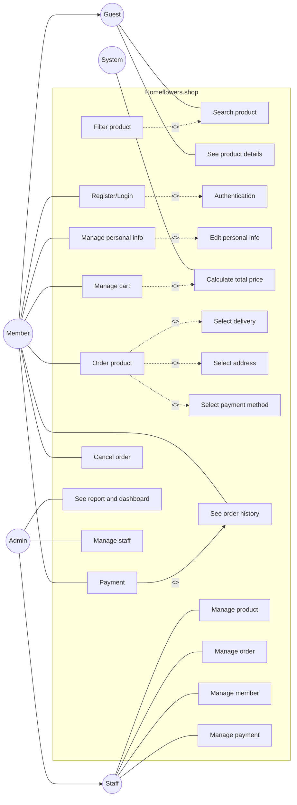

### Class Diagram

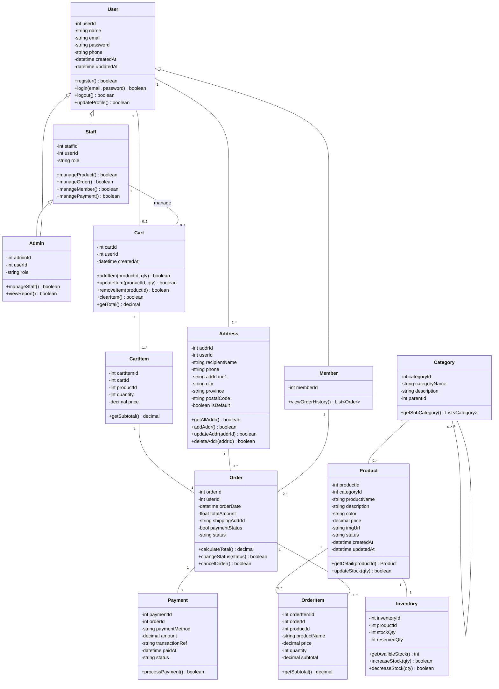

### Sequence Diagram

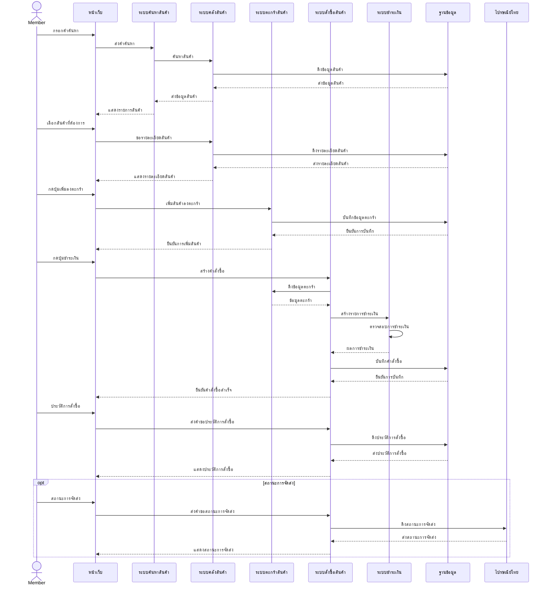

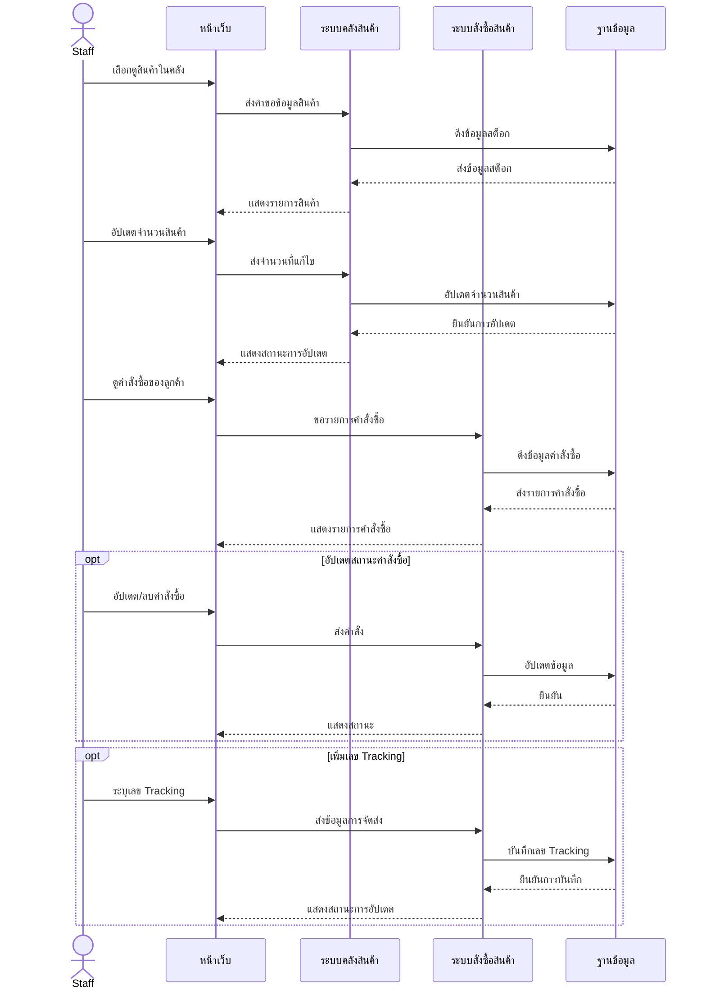

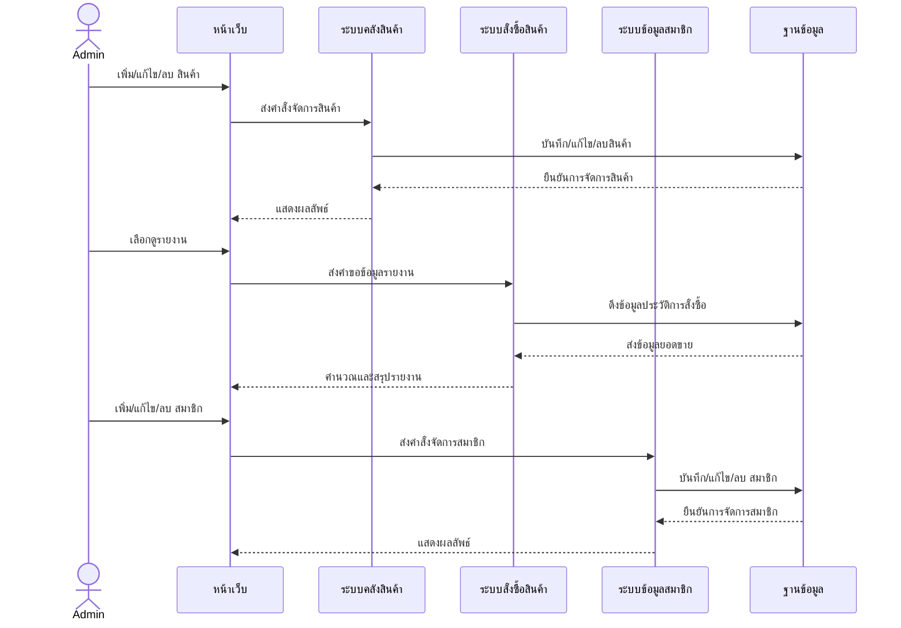


---
# Data Schema (JSON)

ระบบ Home Flower Shop ใช้ **JSON File-based Database** ในการจัดเก็บข้อมูล โดยมีทั้งหมด **6 Collections** ดังนี้

## ภาพรวม Entity ทั้งหมด

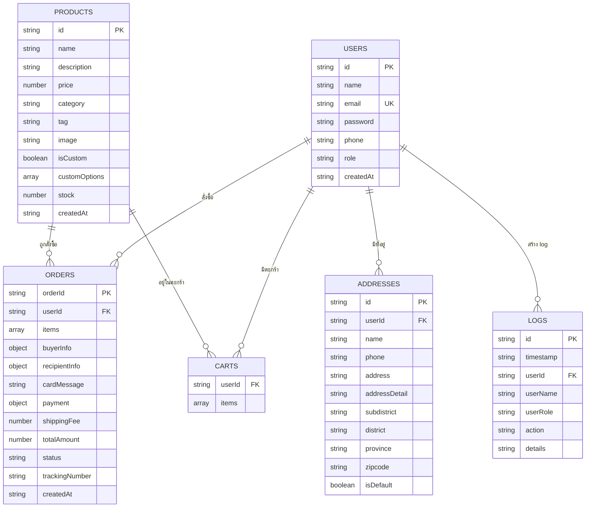

---

## Users Collection — `users.json`

> เก็บข้อมูลผู้ใช้งานทั้งหมดในระบบ (Admin, Staff, Member)

### JSON Schema ตัวอย่าง

```json
{
  "id": "admin-id-001",
  "name": "Shop Owner (Admin)",
  "email": "admin@homeflowershop.com",
  "password": "admin",
  "phone": "0000000000",
  "role": "ADMIN",
  "createdAt": "2026-07-13T17:00:00.000Z"
}
```

### ตาราง Field Definition

| Field | Type | Required | Description |
|-------|------|----------|-------------|
| `id` | `string` (UUID) | ✅ | รหัสผู้ใช้ (Primary Key) สร้างด้วย UUID v4 |
| `name` | `string` | ✅ | ชื่อ-นามสกุล |
| `email` | `string` | ✅ | อีเมล (Unique) ใช้เป็น Login credential |
| `password` | `string` | ✅ | รหัสผ่าน (Plain text — ขอบเขต project ไม่ได้ hash) |
| `phone` | `string` | ✅ | เบอร์โทรศัพท์ |
| `role` | `string` (Enum) | ✅ | บทบาท: `"ADMIN"`, `"STAFF"`, `"MEMBER"` |
| `createdAt` | `string` (ISO 8601) | ✅ | วันเวลาที่สร้างบัญชี |

### Role Permissions

| Role | สิทธิ์การเข้าถึง |
|------|------------------|
| `ADMIN` | จัดการทุกอย่าง: สินค้า, คำสั่งซื้อ, ผู้ใช้, สต๊อก, ดู logs |
| `STAFF` | จัดการคำสั่งซื้อ, จัดการสต๊อก |
| `MEMBER` | ดูสินค้า, สั่งซื้อ, จัดการโปรไฟล์/ที่อยู่ |

---

## Products Collection — `products.json`

> เก็บข้อมูลสินค้าทั้งหมดของร้าน

### JSON Schema ตัวอย่าง — สินค้าสำเร็จรูป

```json
{
  "id": "p1",
  "name": "Basic 1",
  "description": "ช่อดอกไม้สำเร็จรูป",
  "price": 1000,
  "category": "ready-made",
  "tag": "จัดส่งฟรี",
  "image": "basic1.jpg",
  "isCustom": false,
  "stock": 9
}
```

### JSON Schema ตัวอย่าง — สินค้าแบบ Custom

```json
{
  "id": "p2",
  "name": "Custom 1",
  "description": "ช่อดอกไม้จัดเองตามใจชอบ",
  "price": 690,
  "category": "custom",
  "tag": "แนะนำ Custom",
  "image": "custom1.jpg",
  "isCustom": true,
  "customOptions": [
    {
      "name": "Size",
      "choices": ["S", "M", "L"]
    },
    {
      "name": "รูปแบบดอกที่ 1",
      "choices": ["กุหลาบแดง", "กุหลาบขาว", "ทานตะวัน"]
    },
    {
      "name": "รูปแบบดอกที่ 2",
      "choices": ["คาร์เนชั่น", "ลิลลี่", "ยิปโซ"]
    },
    {
      "name": "รูปแบบดอกที่ 3",
      "choices": ["ไม่ระบุ", "ใบเฟิร์น", "ใบยูคาลิปตัส"]
    }
  ],
  "stock": 10
}
```

### ตาราง Field Definition

| Field | Type | Required | Description |
|-------|------|----------|-------------|
| `id` | `string` | ✅ | รหัสสินค้า (PK) เช่น `"p1"` หรือ `"prod-{timestamp}"` |
| `name` | `string` | ✅ | ชื่อสินค้า |
| `description` | `string` | ❌ | รายละเอียดสินค้า |
| `price` | `number` | ✅ | ราคา (บาท) |
| `category` | `string` (Enum) | ✅ | หมวดหมู่หลัก: `"ready-made"`, `"custom"`, `"gift"` |
| `tag` | `string` | ❌ | แท็ก/หมวดย่อย สำหรับกรองหน้าร้าน เช่น `"จัดส่งฟรี"`, `"ตุ๊กตาหมี"` |
| `image` | `string` | ❌ | ชื่อไฟล์รูปภาพ (เก็บใน `/uploads/`) |
| `isCustom` | `boolean` | ❌ | ระบุว่าเป็นสินค้าแบบ Custom ที่ลูกค้าเลือกตัวเลือกได้ |
| `customOptions` | `array<object>` | ❌ | ตัวเลือก Custom (มีเมื่อ `isCustom: true`) |
| `customOptions[].name` | `string` | — | ชื่อตัวเลือก เช่น `"Size"`, `"รูปแบบดอก"` |
| `customOptions[].choices` | `array<string>` | — | รายการตัวเลือกย่อย เช่น `["S","M","L"]` |
| `stock` | `number` | ✅ | จำนวนสต๊อกคงเหลือ |
| `createdAt` | `string` (ISO 8601) | ❌ | วันที่สร้าง (มีเมื่อสร้างผ่าน API) |

### Category Mapping

| Category Value | ชื่อแสดงผล | แท็กที่ใช้ |
|----------------|-----------|-----------|
| `ready-made` | ดอกไม้แห้ง | จัดส่งฟรี, แนะนำ Custom |
| `custom` | ดอกไม้ประดิษฐ์ | จัดส่งฟรี, แนะนำ Custom |
| `gift` | ของขวัญ | ตุ๊กตาหมี, เทียนหอม, กล่อง/การ์ด, การ์ด |

---

## Orders Collection — `orders.json`

> เก็บข้อมูลคำสั่งซื้อทั้งหมด

### JSON Schema ตัวอย่าง

```json
{
  "orderId": "ORD-1784090203104",
  "userId": "fe6da02f-8586-47a7-9892-7570fa5a1001",
  "items": [
    {
      "productId": "p1",
      "name": "Basic 1",
      "price": 1000,
      "quantity": 2
    }
  ],
  "buyerInfo": {
    "name": "ชื่อผู้สั่ง",
    "phone": "0812345678",
    "email": "buyer@example.com"
  },
  "recipientInfo": {
    "name": "ชื่อผู้รับ",
    "address": "ที่อยู่ผู้รับ",
    "phone": "0899999999"
  },
  "cardMessage": "สุขสันต์วันเกิด",
  "payment": {
    "method": "Promptpay (QRcode)",
    "time": "2026-07-09T11:38",
    "slipUrl": "/uploads/slip-xxxxx.jpg",
    "status": "PENDING"
  },
  "shippingFee": 100,
  "totalAmount": 2990,
  "status": "กำลังตรวจสอบการชำระเงิน",
  "trackingNumber": null,
  "createdAt": "2026-07-15T04:36:43.104Z"
}
```

### ตาราง Field Definition

| Field | Type | Required | Description |
|-------|------|----------|-------------|
| `orderId` | `string` | ✅ | รหัสคำสั่งซื้อ (PK) รูปแบบ `"ORD-{timestamp}"` |
| `userId` | `string` | ✅ | รหัสผู้ใช้ (FK → Users) |
| `items` | `array<object>` | ✅ | รายการสินค้าที่สั่ง |
| `items[].productId` | `string` | — | รหัสสินค้า (FK → Products) |
| `items[].name` | `string` | — | ชื่อสินค้า (snapshot ณ เวลาสั่งซื้อ) |
| `items[].price` | `number` | — | ราคาต่อชิ้น |
| `items[].quantity` | `number` | — | จำนวน |
| `buyerInfo` | `object` | ✅ | ข้อมูลผู้สั่ง |
| `buyerInfo.name` | `string` | — | ชื่อผู้สั่ง |
| `buyerInfo.phone` | `string` | — | เบอร์โทรผู้สั่ง |
| `buyerInfo.email` | `string` | — | อีเมลผู้สั่ง |
| `recipientInfo` | `object` | ✅ | ข้อมูลผู้รับ |
| `recipientInfo.name` | `string` | — | ชื่อผู้รับ |
| `recipientInfo.address` | `string` | — | ที่อยู่จัดส่ง |
| `recipientInfo.phone` | `string` | — | เบอร์โทรผู้รับ |
| `cardMessage` | `string` | ❌ | ข้อความบนการ์ด |
| `payment` | `object` | ✅ | ข้อมูลการชำระเงิน |
| `payment.method` | `string` | — | วิธีชำระ: `"Promptpay (QRcode)"`, `"โอนเงินธนาคาร"` |
| `payment.time` | `string` | — | เวลาที่ชำระเงิน |
| `payment.slipUrl` | `string\|null` | — | URL สลิปการโอนเงิน |
| `payment.status` | `string` | — | สถานะ: `"PENDING"`, `"PAID"` |
| `shippingFee` | `number` | ✅ | ค่าจัดส่ง (100 บาท — EMS) |
| `totalAmount` | `number` | ✅ | ยอดรวมทั้งหมด (รวมค่าส่ง) |
| `status` | `string` | ✅ | สถานะคำสั่งซื้อ |
| `trackingNumber` | `string\|null` | ❌ | เลขพัสดุ |
| `createdAt` | `string` (ISO 8601) | ✅ | วันเวลาที่สร้างคำสั่งซื้อ |

### Order Status Flow

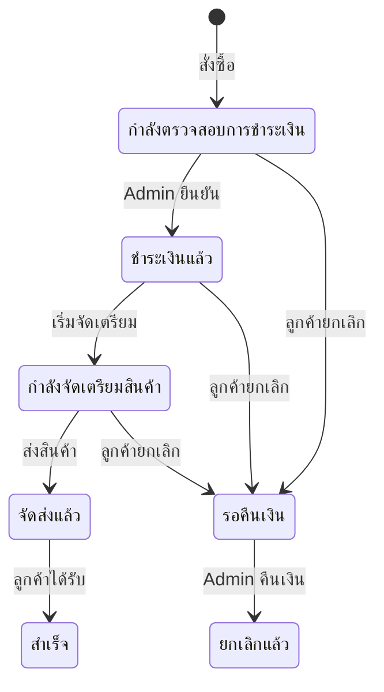

---

## Carts Collection — `carts.json`

> เก็บข้อมูลตะกร้าสินค้าของผู้ใช้แต่ละคน

### JSON Schema ตัวอย่าง

```json
{
  "userId": "fe6da02f-8586-47a7-9892-7570fa5a1001",
  "items": [
    {
      "cartItemId": "ff6ac462-a85b-4322-aee3-2124e2772cce",
      "productId": "p2",
      "quantity": 4,
      "customOptions": null
    }
  ]
}
```

### ตาราง Field Definition

| Field | Type | Required | Description |
|-------|------|----------|-------------|
| `userId` | `string` | ✅ | รหัสผู้ใช้ (FK → Users) — เป็น key ของตะกร้า |
| `items` | `array<object>` | ✅ | รายการสินค้าในตะกร้า |
| `items[].cartItemId` | `string` (UUID) | — | รหัส item ในตะกร้า (เพื่อจัดการแยกรายการ) |
| `items[].productId` | `string` | — | รหัสสินค้า (FK → Products) |
| `items[].quantity` | `number` | — | จำนวนชิ้น |
| `items[].customOptions` | `object\|null` | — | ตัวเลือก Custom ที่ลูกค้าเลือก (ถ้ามี) |

---

## Addresses Collection — `addresses.json`

> เก็บที่อยู่สำหรับจัดส่งของผู้ใช้ (1 คนมีได้หลายที่อยู่)

### JSON Schema ตัวอย่าง

```json
{
  "id": "47283bcd-6e5a-48b2-8a0f-d2f1e9eeb59c",
  "userId": "e3e2a1bb-2938-4762-a7dd-39efca582ed8",
  "name": "แฮม",
  "phone": "1234567890",
  "address": "123/45 ต.บางพูด อ.ปากเกร็ด จ.นนทบุรี 11120",
  "addressDetail": "123/45",
  "subdistrict": "บางพูด",
  "district": "ปากเกร็ด",
  "province": "นนทบุรี",
  "zipcode": "11120",
  "isDefault": true
}
```

### ตาราง Field Definition

| Field | Type | Required | Description |
|-------|------|----------|-------------|
| `id` | `string` (UUID) | ✅ | รหัสที่อยู่ (PK) |
| `userId` | `string` | ✅ | รหัสผู้ใช้ (FK → Users) |
| `name` | `string` | ✅ | ชื่อ-นามสกุลผู้รับ |
| `phone` | `string` | ✅ | เบอร์โทรผู้รับ |
| `address` | `string` | ✅ | ที่อยู่แบบรวม (ใช้แสดงผล) |
| `addressDetail` | `string` | ✅ | รายละเอียดที่อยู่ (บ้านเลขที่, ซอย, หมู่, ถนน) |
| `subdistrict` | `string` | ✅ | ตำบล/แขวง |
| `district` | `string` | ✅ | อำเภอ/เขต |
| `province` | `string` | ✅ | จังหวัด |
| `zipcode` | `string` | ✅ | รหัสไปรษณีย์ |
| `isDefault` | `boolean` | ✅ | ที่อยู่เริ่มต้นสำหรับจัดส่ง |

---

## Logs Collection — `logs.json`

> เก็บ log การดำเนินการทั้งหมดในระบบ (Audit Trail)

### JSON Schema ตัวอย่าง

```json
{
  "id": "LOG-1784486108773162",
  "timestamp": "2026-07-19T18:35:08.773Z",
  "userId": "89d0a52b-7657-43cd-8637-eeb5d9aca445",
  "userName": "กาก",
  "userRole": "MEMBER",
  "action": "CANCEL_ORDER",
  "details": "Requested cancellation for order ORD-1784486074910"
}
```

### ตาราง Field Definition

| Field | Type | Required | Description |
|-------|------|----------|-------------|
| `id` | `string` | ✅ | รหัส Log (PK) รูปแบบ `"LOG-{timestamp}{random}"` |
| `timestamp` | `string` (ISO 8601) | ✅ | เวลาที่เกิดเหตุการณ์ |
| `userId` | `string` | ✅ | รหัสผู้ใช้ที่ทำ action (FK → Users) |
| `userName` | `string` | ✅ | ชื่อผู้ใช้ (snapshot) |
| `userRole` | `string` | ✅ | บทบาทผู้ใช้ ณ เวลานั้น |
| `action` | `string` (Enum) | ✅ | ประเภท action |
| `details` | `string` | ✅ | รายละเอียดเพิ่มเติม |

### Action Types

| Action | Description | ใครทำได้ |
|--------|-------------|---------|
| `REGISTER` | สมัครสมาชิก | ทุกคน |
| `LOGIN` | เข้าสู่ระบบ | ทุกคน |
| `ADD_TO_CART` | เพิ่มสินค้าลงตะกร้า | Member |
| `CREATE_ORDER` | สร้างคำสั่งซื้อ | Member |
| `CANCEL_ORDER` | ยกเลิกคำสั่งซื้อ | Member |
| `CREATE_PRODUCT` | เพิ่มสินค้าใหม่ | Admin |
| `UPDATE_PRODUCT` | แก้ไขข้อมูลสินค้า | Admin/Staff |
| `DELETE_PRODUCT` | ลบสินค้า | Admin |
| `UPDATE_ORDER_STATUS` | อัปเดตสถานะคำสั่งซื้อ | Admin/Staff |
| `UPDATE_USER_ROLE` | เปลี่ยนบทบาทผู้ใช้ | Admin |
| `DELETE_USER` | ลบผู้ใช้ | Admin |

---

## ความสัมพันธ์ระหว่าง Data (Relationships)

| ความสัมพันธ์ | ชนิด | คำอธิบาย |
|-------------|------|----------|
| Users → Carts | 1:1 | ผู้ใช้ 1 คนมีตะกร้า 1 ใบ |
| Users → Orders | 1:N | ผู้ใช้ 1 คนสั่งซื้อได้หลายครั้ง |
| Users → Addresses | 1:N | ผู้ใช้ 1 คนมีที่อยู่ได้หลายแห่ง |
| Users → Logs | 1:N | ผู้ใช้ 1 คนสร้าง log ได้หลายรายการ |
| Products → Carts | M:N | สินค้าหลายรายการอยู่ในตะกร้าหลายใบ (ผ่าน items[]) |
| Products → Orders | M:N | สินค้าหลายรายการอยู่ในหลายคำสั่งซื้อ (ผ่าน items[]) |

---
---

# System Architecture

## ภาพรวมสถาปัตยกรรมระบบ

ระบบ Home Flower Shop ใช้สถาปัตยกรรมแบบ **Client-Server (2-Tier)** ประกอบด้วย Frontend (SPA) และ Backend (REST API + WebSocket)

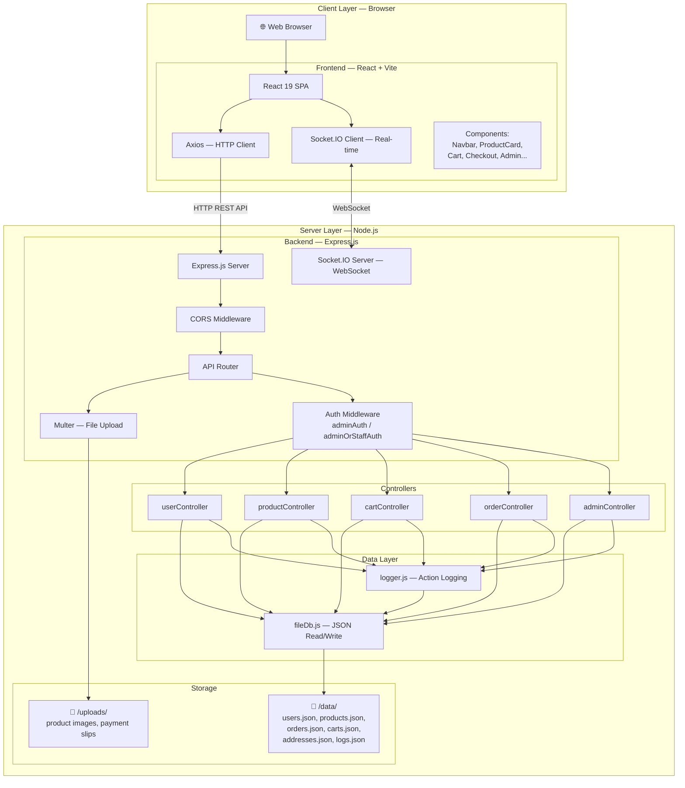

---

## Technology Stack

### Frontend

| เทคโนโลยี | เวอร์ชัน | หน้าที่ |
|-----------|---------|--------|
| **React** | 19.1.1 | UI Framework — สร้าง SPA (Single Page Application) |
| **Vite** | 7.3.6 | Build Tool — Dev server พร้อม HMR (Hot Module Replacement) |
| **Axios** | 1.18.1 | HTTP Client — ติดต่อ REST API |
| **Socket.IO Client** | 4.8.3 | WebSocket Client — รับ-ส่งข้อมูล real-time |
| **react-thailand-address-typeahead** | 2.0.1 | Typeahead สำหรับที่อยู่ไทย (จังหวัด, อำเภอ, ตำบล, รหัสไปรษณีย์) |
| **Vanilla CSS** | — | Styling — ใช้ CSS ล้วนไม่พึ่ง framework |

### Backend

| เทคโนโลยี | เวอร์ชัน | หน้าที่ |
|-----------|---------|--------|
| **Node.js** | — | Runtime Environment |
| **Express.js** | 5.2.1 | Web Framework — จัดการ routing, middleware |
| **Socket.IO** | 4.8.3 | WebSocket Server — push events ไปยัง client |
| **Multer** | 2.2.0 | File Upload — จัดการ multipart/form-data |
| **UUID** | 14.0.1 | สร้าง Unique ID สำหรับ entities |
| **CORS** | 2.8.6 | Cross-Origin Resource Sharing |
| **Nodemon** | 3.1.14 (dev) | Auto-restart server เมื่อแก้ไขโค้ด |

### Data Storage

| ประเภท | เทคโนโลยี | หน้าที่ |
|--------|-----------|--------|
| **Database** | JSON Files | เก็บข้อมูลทั้งหมดในรูปแบบ .json (File-based DB) |
| **File Storage** | `/uploads/` directory | เก็บรูปภาพสินค้า, สลิปการโอนเงิน |

---

## โครงสร้างโฟลเดอร์ (Folder Structure)

```
CSI204-PROJ-FINAL-HOME-FLOWER-SHOP/
├── back/                          # ⚙️ Backend (Node.js + Express)
│   ├── index.js                   #    Entry point — สร้าง server, mount routes
│   ├── package.json               #    Dependencies
│   ├── data/                      #    📁 JSON Database
│   │   ├── users.json
│   │   ├── products.json
│   │   ├── orders.json
│   │   ├── carts.json
│   │   ├── addresses.json
│   │   └── logs.json
│   ├── uploads/                   #    📁 Uploaded files (images, slips)
│   └── src/
│       ├── controllers/           #    🎮 Business Logic
│       │   ├── userController.js
│       │   ├── productController.js
│       │   ├── cartController.js
│       │   ├── orderController.js
│       │   └── adminController.js
│       ├── routes/                #    🛣️ API Routes
│       │   ├── userRoutes.js
│       │   ├── productRoutes.js
│       │   ├── cartRoutes.js
│       │   ├── orderRoutes.js
│       │   └── adminRoutes.js
│       ├── middleware/            #    🔒 Auth Middleware
│       │   ├── adminAuth.js
│       │   └── adminOrStaffAuth.js
│       └── utils/                 #    🔧 Utilities
│           ├── fileDb.js          #        JSON file read/write
│           └── logger.js          #        Action logging
│
└── front/                         # 🎨 Frontend (React + Vite)
    ├── index.html                 #    HTML Entry point
    ├── package.json               #    Dependencies
    ├── vite.config.js             #    Vite configuration
    └── src/
        ├── main.jsx               #    React entry point
        ├── App.jsx                #    🏠 Root component — routing, state
        ├── App.css                #    Global styles
        ├── index.css              #    CSS Variables / Design tokens
        ├── styles/                #    📁 Component-specific CSS
        │   ├── modal.css
        │   ├── profile-view.css
        │   ├── responsive.css
        │   └── orders-modal.css
        └── component/             #    📁 React Components
            ├── Navbar.jsx         #        Navigation bar
            ├── HeroBanner.jsx     #        Hero section หน้าแรก
            ├── HomeView.jsx       #        หน้าแรก
            ├── WireframeView.jsx  #        หน้าสินค้าตามหมวดหมู่
            ├── ProductCard.jsx    #        การ์ดสินค้า
            ├── CartDrawer.jsx     #        ตะกร้าสินค้า
            ├── CheckoutModal.jsx  #        หน้าชำระเงิน
            ├── AuthModal.jsx      #        Login / Register
            ├── OrdersModal.jsx    #        ดูคำสั่งซื้อ
            ├── ProfileView.jsx    #        โปรไฟล์ + ที่อยู่
            ├── OrderTermsView.jsx #        เงื่อนไขการสั่งซื้อ
            ├── Footer.jsx         #        Footer
            ├── ErrorBoundary.jsx  #        Error handling
            └── admin/             #        📁 Admin Panel
                ├── AdminDashboard.jsx
                ├── AdminStats.jsx
                ├── AdminOrders.jsx
                ├── AdminProducts.jsx
                ├── AdminStock.jsx
                ├── AdminUsers.jsx
                └── AdminLogs.jsx
```

---

## API Endpoints

### 👤 Users API — `/api/users`

| Method | Endpoint | Description | Auth |
|--------|----------|-------------|------|
| `POST` | `/api/users/register` | สมัครสมาชิก | ❌ |
| `POST` | `/api/users/login` | เข้าสู่ระบบ | ❌ |
| `GET` | `/api/users/:id` | ดูข้อมูลผู้ใช้ | ❌ |
| `PUT` | `/api/users/:id` | แก้ไขโปรไฟล์ | ❌ |
| `GET` | `/api/users/:userId/addresses` | ดูที่อยู่ทั้งหมด | ❌ |
| `POST` | `/api/users/:userId/addresses` | เพิ่มที่อยู่ | ❌ |
| `PUT` | `/api/users/:userId/addresses/:addressId` | แก้ไขที่อยู่ | ❌ |
| `DELETE` | `/api/users/:userId/addresses/:addressId` | ลบที่อยู่ | ❌ |

### 🌸 Products API — `/api/products`

| Method | Endpoint | Description | Auth |
|--------|----------|-------------|------|
| `GET` | `/api/products` | ดูสินค้าทั้งหมด (supports `?category=` `?search=`) | ❌ |
| `GET` | `/api/products/:id` | ดูสินค้าตาม ID | ❌ |
| `POST` | `/api/products` | เพิ่มสินค้าใหม่ (multipart) | 🔒 Admin/Staff |
| `PUT` | `/api/products/:id` | แก้ไขสินค้า (multipart) | 🔒 Admin/Staff |
| `DELETE` | `/api/products/:id` | ลบสินค้า | 🔒 Admin/Staff |

### 🛒 Cart API — `/api/cart`

| Method | Endpoint | Description | Auth |
|--------|----------|-------------|------|
| `GET` | `/api/cart/:userId` | ดูตะกร้าของผู้ใช้ | ❌ |
| `POST` | `/api/cart/:userId` | เพิ่มสินค้าลงตะกร้า | ❌ |
| `PUT` | `/api/cart/:userId/:cartItemId` | แก้ไขจำนวนสินค้า | ❌ |
| `DELETE` | `/api/cart/:userId/:cartItemId` | ลบสินค้าจากตะกร้า | ❌ |

### 📦 Orders API — `/api/orders`

| Method | Endpoint | Description | Auth |
|--------|----------|-------------|------|
| `POST` | `/api/orders/checkout` | สร้างคำสั่งซื้อ (checkout) | ❌ |
| `GET` | `/api/orders/user/:userId` | ดูคำสั่งซื้อของผู้ใช้ | ❌ |
| `GET` | `/api/orders/:orderId` | ดูคำสั่งซื้อตาม ID | ❌ |
| `POST` | `/api/orders/:userId/cancel/:orderId` | ยกเลิกคำสั่งซื้อ | ❌ |

### 🔧 Admin API — `/api/admin`

| Method | Endpoint | Description | Auth |
|--------|----------|-------------|------|
| `GET` | `/api/admin/orders` | ดูคำสั่งซื้อทั้งหมด | 🔒 Admin/Staff |
| `PUT` | `/api/admin/orders/:orderId` | อัปเดตสถานะ/เลขพัสดุ | 🔒 Admin/Staff |
| `GET` | `/api/admin/users` | ดูผู้ใช้ทั้งหมด | 🔒 Admin |
| `PUT` | `/api/admin/users/:id/role` | เปลี่ยนบทบาทผู้ใช้ | 🔒 Admin |
| `DELETE` | `/api/admin/users/:id` | ลบผู้ใช้ | 🔒 Admin |
| `GET` | `/api/admin/logs` | ดู Audit Logs | 🔒 Admin |

---

## Middleware Pipeline

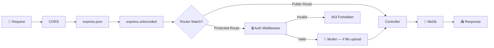

### Auth Middleware ทำงานอย่างไร

1. **`adminAuth.js`** — ตรวจสอบ `x-user-id` header, ค้นหา user ใน `users.json`, ยืนยันว่า role = `"ADMIN"`
2. **`adminOrStaffAuth.js`** — เหมือน `adminAuth` แต่อนุญาตทั้ง `"ADMIN"` และ `"STAFF"`

---

## Real-time Communication — WebSocket

ระบบใช้ **Socket.IO** สำหรับ push events แบบ real-time

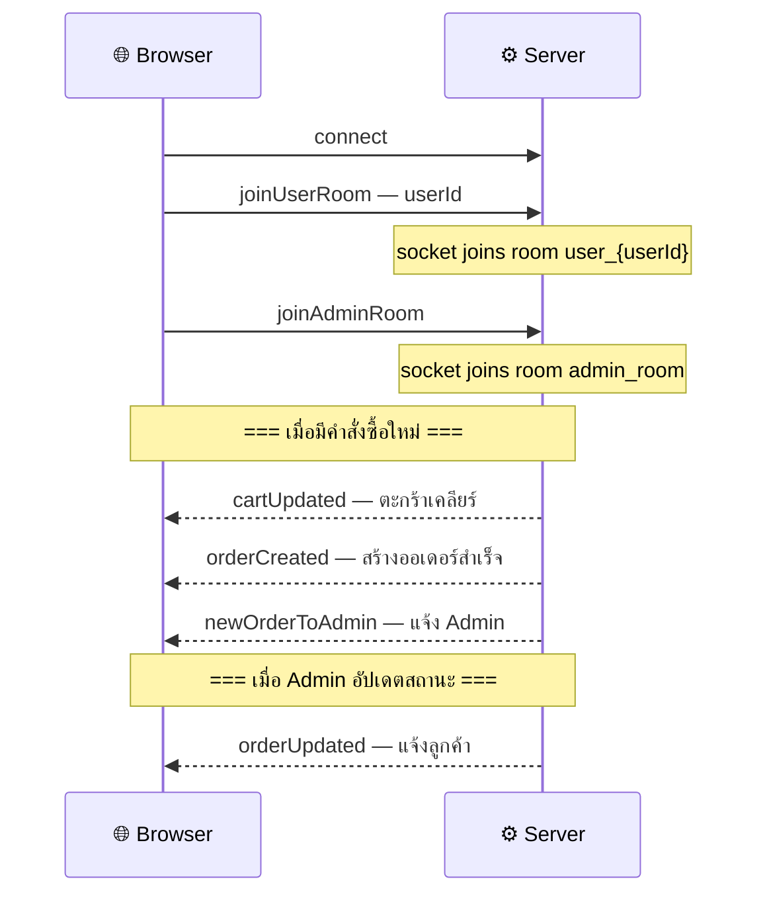

### Socket Events

| Event | Direction | Room | Description |
|-------|-----------|------|-------------|
| `joinUserRoom` | Client → Server | `user_{userId}` | เข้า room ส่วนตัว |
| `joinAdminRoom` | Client → Server | `admin_room` | เข้า room admin |
| `cartUpdated` | Server → Client | `user_{userId}` | ตะกร้าเปลี่ยน (เพิ่ม/ลบ/เคลียร์) |
| `orderCreated` | Server → Client | `user_{userId}` | สร้างคำสั่งซื้อสำเร็จ |
| `orderUpdated` | Server → Client | `user_{userId}` | สถานะคำสั่งซื้อเปลี่ยน |
| `newOrderToAdmin` | Server → Client | `admin_room` | แจ้ง admin มีออเดอร์ใหม่ |

---

## Data Flow — ตัวอย่างขั้นตอนการสั่งซื้อ

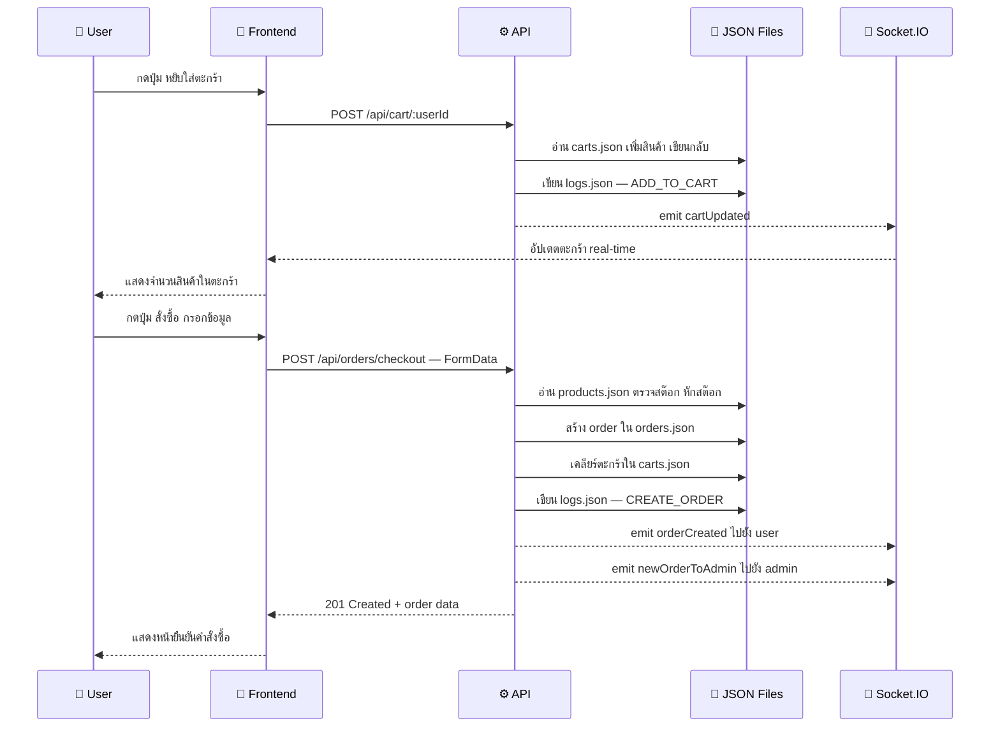

---

## Security Overview

| ด้าน | รายละเอียด |
|------|-----------|
| **Authentication** | ใช้ Session-based (sessionStorage) — ยืนยันตัวตนผ่าน email/password |
| **Authorization** | Middleware ตรวจสอบ `x-user-id` header + role ใน users.json |
| **CORS** | เปิดให้ทุก origin สำหรับ development |
| **File Upload** | Multer จำกัดเฉพาะรูปภาพ สร้างชื่อไฟล์ unique ด้วย timestamp |
| **Input Validation** | ตรวจสอบ required fields ใน controller (name, price, email ฯลฯ) |

> [!NOTE]
> ระบบนี้เป็นโปรเจกต์สำหรับรายวิชา CSI204 — ในขอบเขตของ project ไม่ได้ใช้ JWT, bcrypt hash, หรือ HTTPS เนื่องจากเป็น prototype เพื่อการเรียนรู้

---
## ✅ User Acceptance Testing (UAT)

มีการทดสอบระบบทั้งหมด **21 Test Case** ครอบคลุมการทำงานของผู้ใช้งานทุกประเภท ได้แก่ Customer, Staff และ Admin

## 📋 รายละเอียด Test Case

| Test Case | ผู้ใช้งาน | รายละเอียด | ผลการทดสอบ |
|-----------|-----------|------------|-------------|
| UAT-C01 | Customer | สมัครสมาชิก | ✅ ผ่าน |
| UAT-C02 | Customer | เข้าสู่ระบบ | ✅ ผ่าน |
| UAT-C03 | Customer | ค้นหาสินค้า | ✅ ผ่าน |
| UAT-C04 | Customer | เพิ่มสินค้าในตะกร้า | ✅ ผ่าน |
| UAT-C05 | Customer | ชำระเงิน | ✅ ผ่าน |
| UAT-C06 | Customer | ตรวจสอบประวัติการสั่งซื้อ | ✅ ผ่าน |
| UAT-C07 | Customer | ยกเลิกออเดอร์ | ✅ ผ่าน |
|-----------|-----------|------------|-------------|

| Test Case | ผู้ใช้งาน | รายละเอียด | ผลการทดสอบ |
|-----------|-----------|------------|-------------|
| UAT-S01 | Staff | ตรวจสอบคำสั่งซื้อ | ✅ ผ่าน |
| UAT-S02 | Staff | อัปเดทสถานะสินค้า | ✅ ผ่าน |
| UAT-S03 | Staff | จัดการสต็อกสินค้า | ✅ ผ่าน |
| UAT-S04 | Staff | เพิ่มจำนวนสินค้าในคลัง | ✅ ผ่าน |
| UAT-S05 | Staff | ลดจำนวนสินค้าในคลัง | ✅ ผ่าน |
|-----------|-----------|------------|-------------|

| Test Case | ผู้ใช้งาน | รายละเอียด | ผลการทดสอบ |
|-----------|-----------|------------|-------------|
| UAT-A01 | Admin | เพิ่มข้อมูลสินค้า | ✅ ผ่าน |
| UAT-A02 | Admin | แก้ไขข้อมูลสินค้า | ✅ ผ่าน |
| UAT-A03 | Admin | ดูรายงานยอดขาย | ✅ ผ่าน |
| UAT-A04 | Admin | ลบสมาชิก | ✅ ผ่าน |
| UAT-A05 | Admin | ค้นหาสินค้า | ✅ ผ่าน |
| UAT-A06 | Admin | ลบสินค้า | ✅ ผ่าน |
| UAT-A07 | Admin | ค้นหาสมาชิก | ✅ ผ่าน |
| UAT-A07 | Admin | เพิ่มสมาชิก | ✅ ผ่าน |
| UAT-A07 | Admin | อัปเดตสมาชิก | ✅ ผ่าน |
|-----------|-----------|------------|-------------|

### ผลการทดสอบ

| รายการ | จำนวน |
|--------|------:|
| Test Case ทั้งหมด | 21 |
| ผ่านการทดสอบ | 21 |
| ไม่ผ่านการทดสอบ | 0 |
| อัตราการผ่าน | 100% |

### อัตราผ่านการทดสอบ
จากการทดสอบ User Acceptance Testing (UAT) พบว่าระบบผ่านการทดสอบทั้งหมด 21 Test Case คิดเป็นอัตราการผ่าน 100% โดย ไม่มี Test Case ที่ไม่ผ่านการทดสอบ (0 รายการ) แสดงให้เห็นว่าระบบสามารถทำงานได้ถูกต้องตามความต้องการของผู้ใช้งาน (User Requirements) และพร้อมสำหรับการนำไปใช้งานจริง

### สรุปผลการประเมิน UAT:
ระบบมีผลการทดสอบผ่านครบทั้ง 21 Test Case (100%) และไม่พบข้อผิดพลาดที่ส่งผลกระทบต่อการทำงานหลักของระบบ แสดงให้เห็นว่าระบบสามารถตอบสนองความต้องการของผู้ใช้งานได้อย่างครบถ้วน มีความถูกต้องในการทำงาน และมีความพร้อมสำหรับการนำไปใช้งานจริงตามวัตถุประสงค์ของโครงงาน

---

<div align="center">

**🌸 Homeflowers.shop - บ้านดอกไม้ 🌸**

</div>
